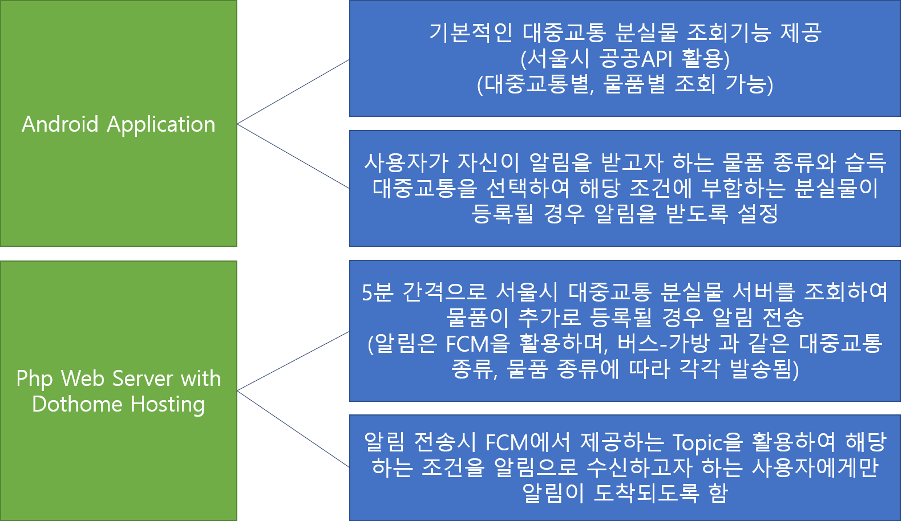

# 2018 KAIST TEAM CODING CHALLENGE  출품작: 대중교통 분실물 파인더 +a

# 팀원

> 유용민 : 팀장, Android Application 프로그래밍, php Server 프로그래밍

> 김영현 : Android Application 프로그래밍

> 정승민 : Android Application 디자인, Graphic 담당

# 개발기간

> 2018년 2월 ~ 2018년 3월

# 프로젝트 개요

> 본 프로젝트에서 목표한 바는 기존의 대중교통 분실물 조회 앱을 개선한 것으로, 사용자가 잃어버린 물품과 분실 장소를 지정하면 해당 조건에 맞는 분실물이 등록되었을 떄 앱으로 알림을 전송해줌으로써 일일히 조회해보아야 분실물 정보를 알 수 있는 기존의 단점을 개선함.

# 활용 API

> Google Firebase Cloud Messaging(FCM) : 푸시알림 구현

> 서울시 공공API : 대중교통 및 물품 종류에 따른 분실물 조회

> Dothome : 서버 호스팅
